# Armado

### Módulo de energía + Raspberry
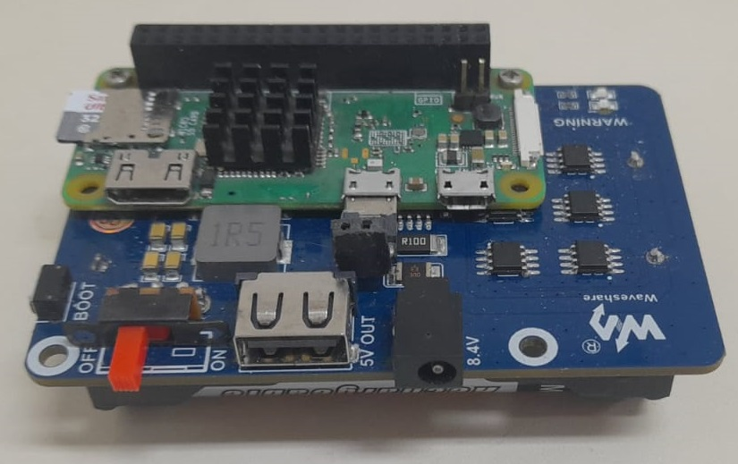
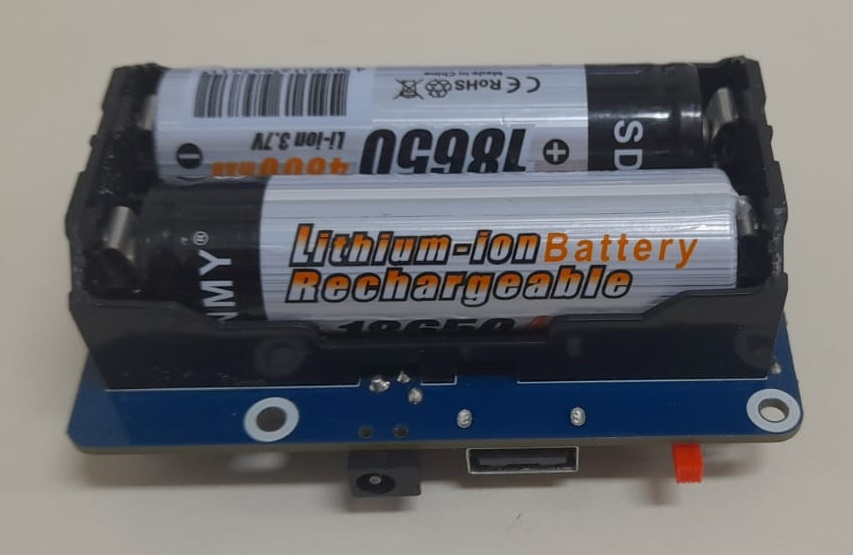

### Cámara y bracket

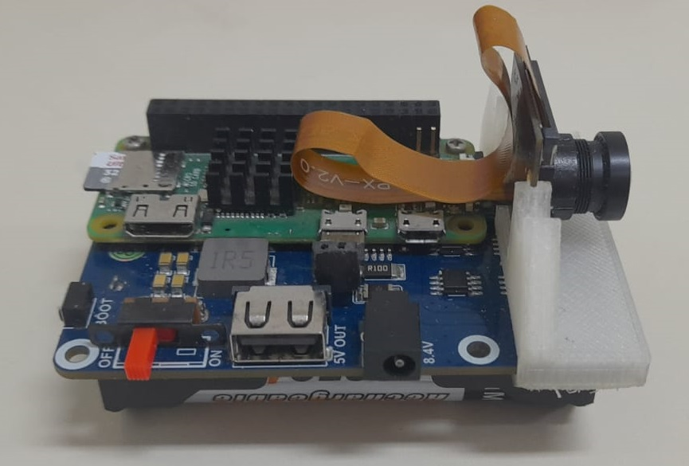
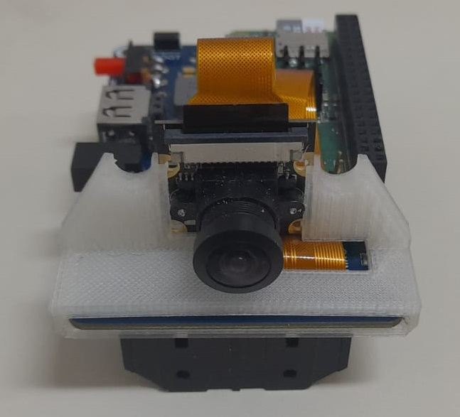
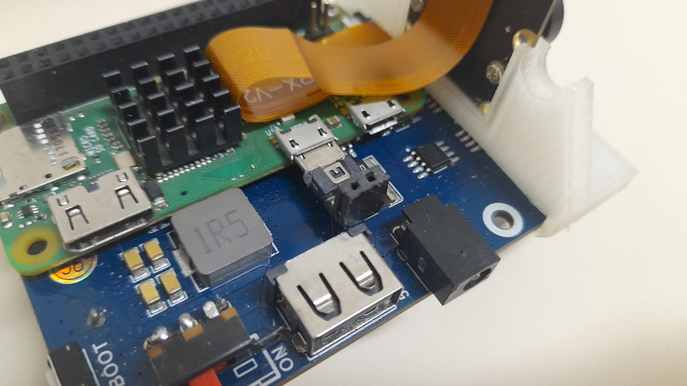

### Tarjeta auxiliar

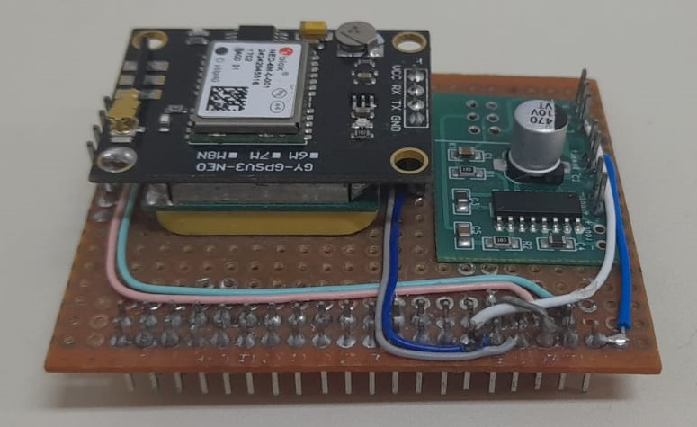

### Instalación de tarjeta auxiliar

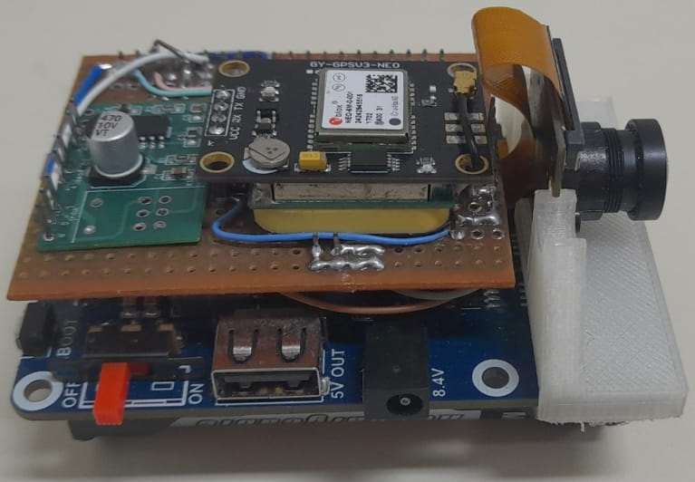

### Módulo de comunicación

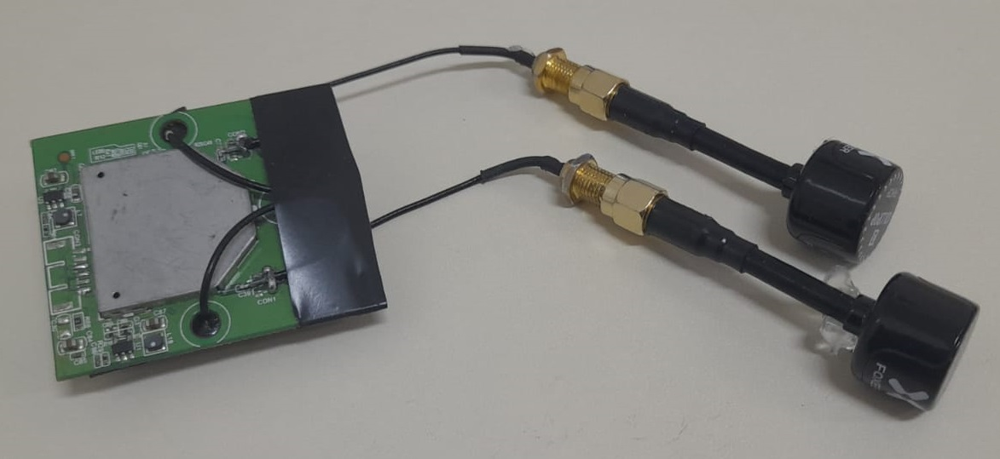
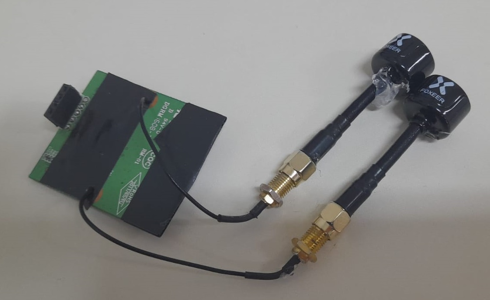

### Instalación de módulo de comunicacíon

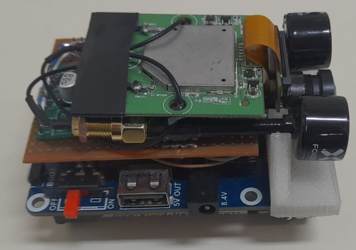
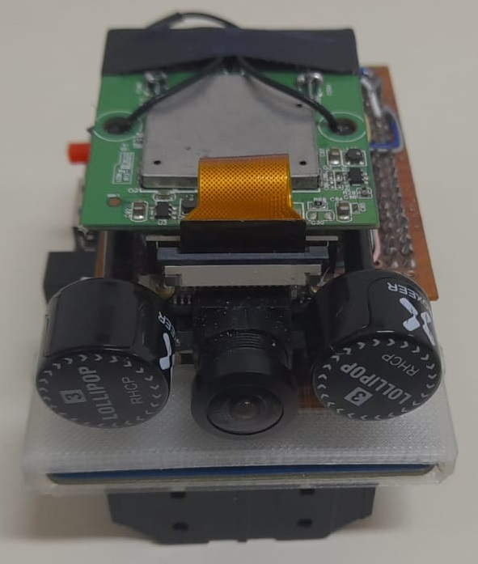

### Instalación en carcasa

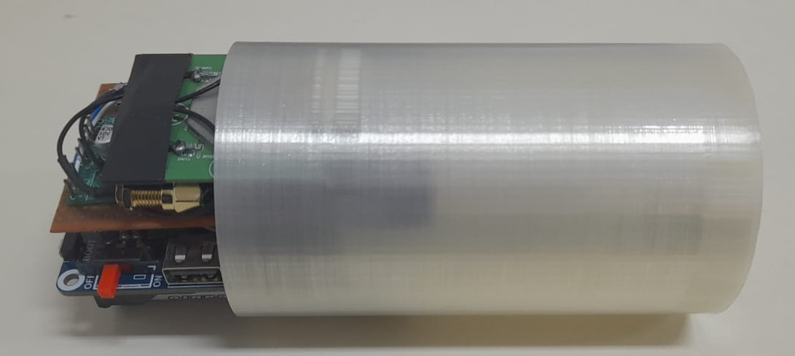
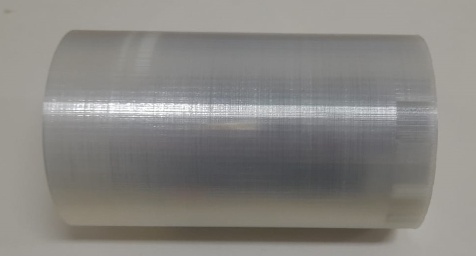

### Terminado (sin paracaídas)

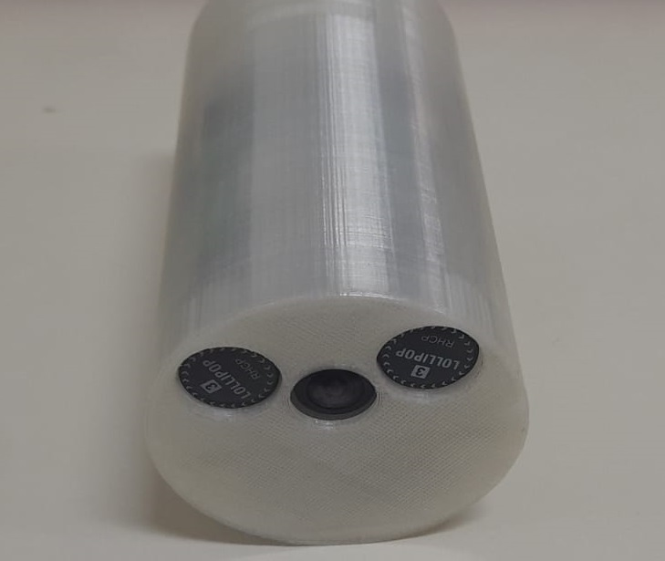
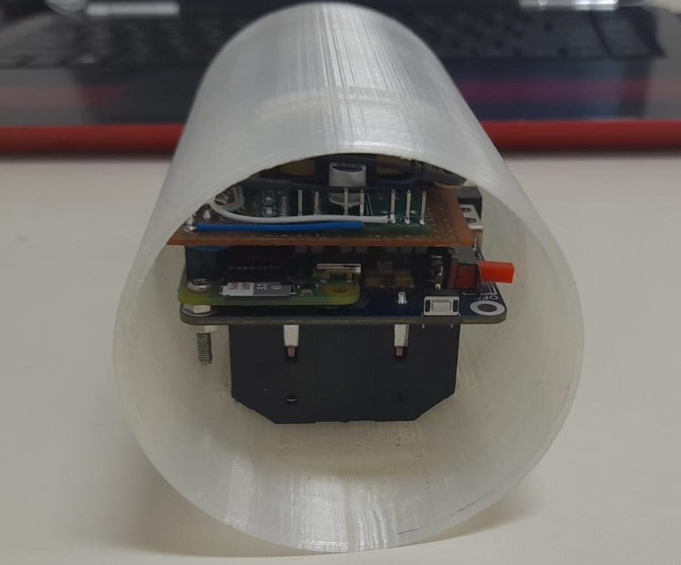
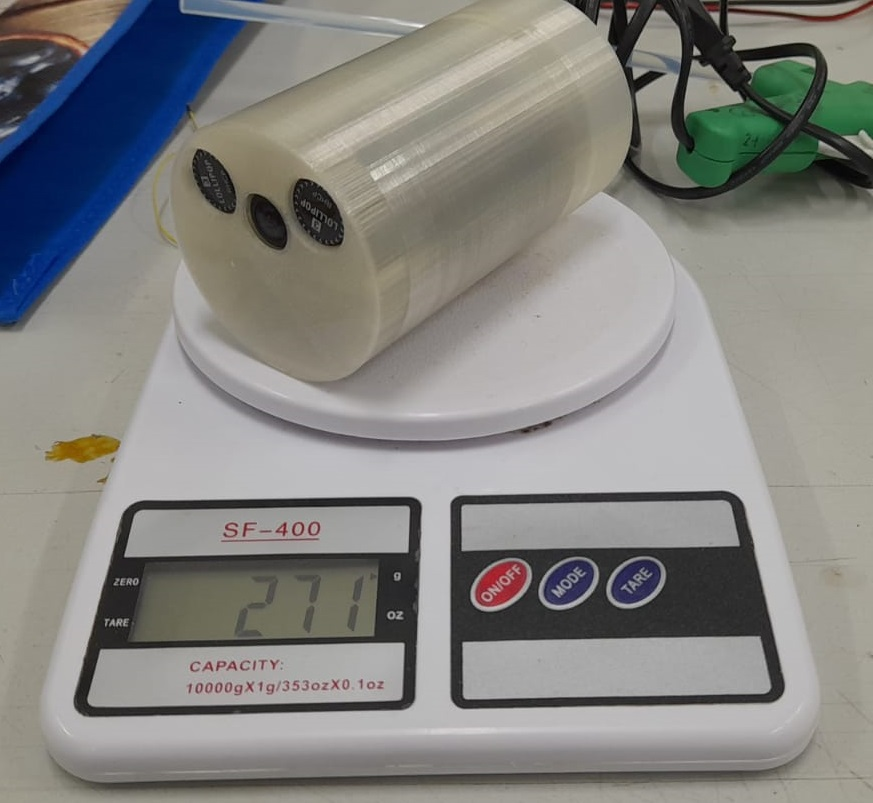
